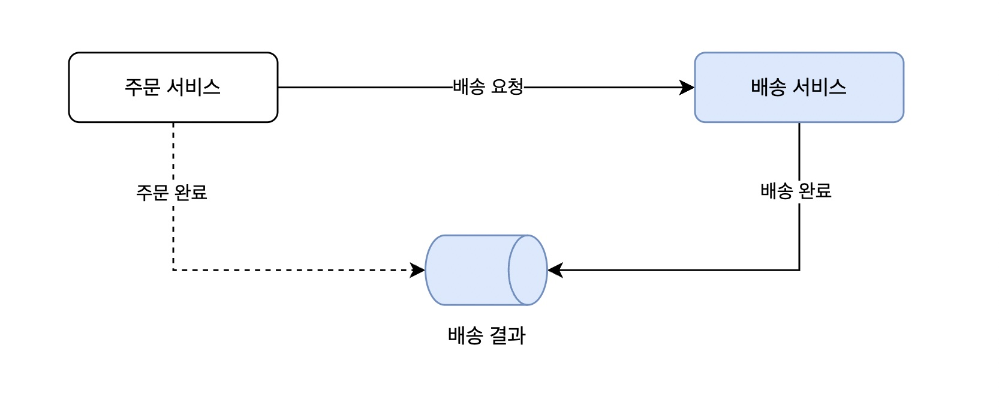

# 설명
분산 시스템에서 데이터를 전달하는 방법을 코딩합니다. 

# 구현
## 프로젝트 summary

간단한 '주문 서비스'와 '배송 서비스'가 있습니다. 
1. 주문 서비스는 클라이언트로부터 주문을 받습니다. 
2. 주문 서비스는 배송을 위해서 배송 서비스에 배송 요청을 합니다.
3. 배송 서비스는 배송을 진행합니다. 
4. 배송이 완료되면 주문 서비스에 `배송이 완료되었다`는 정보를 전달합니다. 
5. 주문 서비스는 배송이 완료되면 주문 상태를 `완료`로 변경합니다. 

이번 예시에서는 위 순서에서 4, 5번 단계를 구현합니다. 
1. 배송이 완료되면 배송 서비스는 배송 상태를 완료로 변경하고 '배송 결과 메시지 큐'에 메시지를 발행합니다. 
2. 주문 서비스는 메시지 배송 결과를 확인하고 주문 상태를 '완료'로 변경합니다. 

