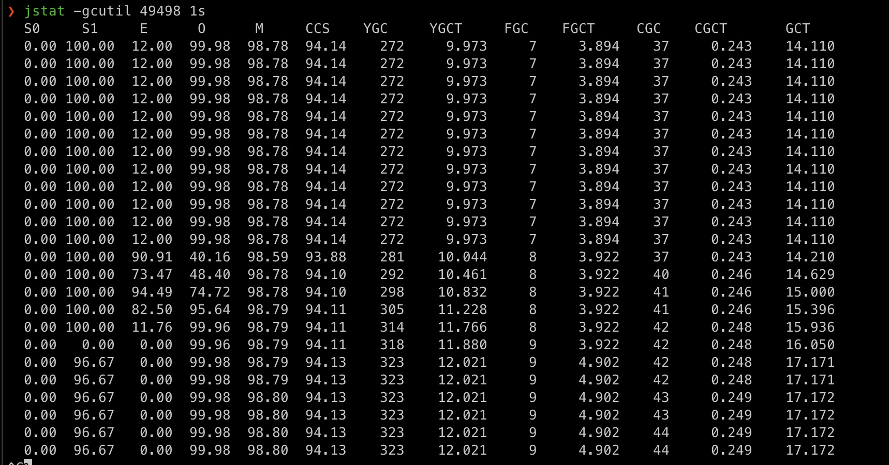
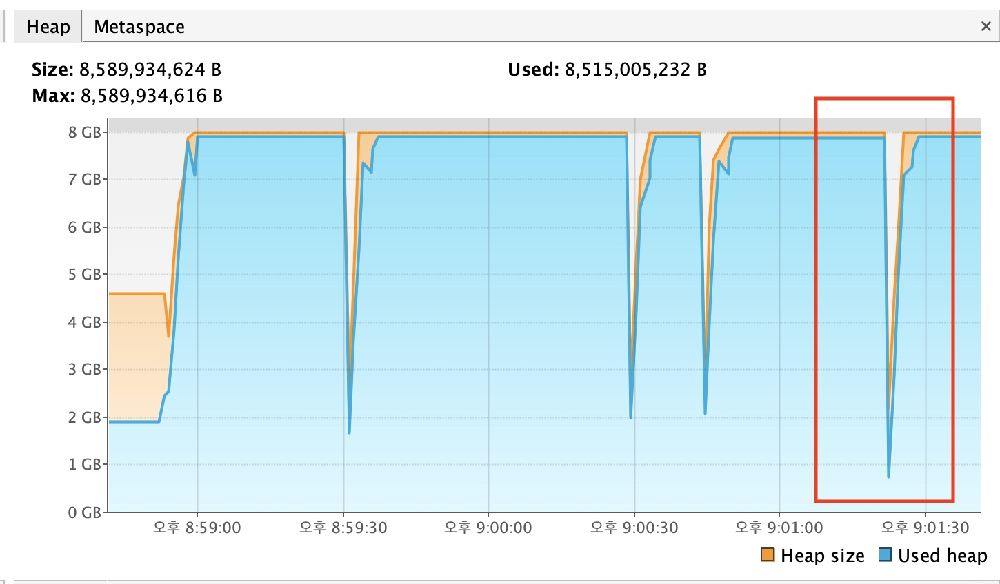

# GC 모니터링
## 참고 링크
링크
- GC 관련 정리: https://github.com/YoungChulShin/TIL/blob/master/Java/GC.md
- 자바 최적화 책 정리: https://github.com/YoungChulShin/TIR/blob/master/기술서적/%5BJava%5D%20자바%20최적화/08.GC로깅_모니터링_튜닝.md

## 저장소 설명
GC를 임의로 발생시키고 그 결과를 모니터링합니다.

## 테스트 내용
### 케이스
- `jstat` 실행해서 gc 장보를 모니터링한다
- `visualVM`을 실행해서 UI 환경에서 정보를 모니털한다

I
### API 정보
- 정보: n 개의 인스턴스를 생성해서 List에 추가하는 API
- url: /test/create-instance
- queryParam
   - times: 인스턴스 생성 횟수
- sample
   ```
   curl -X POST http://localhost:8080/test/create-instance\?times\=1000000
   ```

### GC 모니터링
1. 프로그램 실행
   ```
   java -Xms1024m -Xmx4096m -XX:+PrintGCDetails -Xlog:gc:test.log -jar java8-gc-motniroing-0.0.1-SNAPSHOT.jar 
   ```
2. 프로세스 확인
   ```
   jps
   ```
3. jstat 실행
   ```
   // 1초에 한번씩 실행
   jstat -gcutil <<process id>> 1s
   ```

## 모니터링 결과
### jstat

- S0: survival0 공간 0%
- S1: survival1 공간 96%
- E: enden 공간 0%
- O: old 공간 99.98%
- YGC: Young generation gc 횟수
- YGCT: Young generation gc 발행 전체 시간
- FGC: full gc 횟수
- FGCT: full gc 발생 전체 시간

full gc 시간: 4.902 / 9

### visualVM

- full gc가 발생하는 시점에 메모리가 내려가는 것이 보인다

### log
`-Xlog:gc:test.log` 옵션으로 경로에 `test.log` 파일이 생성된다
```
[0.769s][info][gc,metaspace] GC(2) Metaspace: 21292K(21504K)->21292K(21504K) NonClass: 18610K(18688K)->18610K(18688K) Class: 2682K(2816K)->2682K(2816K)
[0.769s][info][gc          ] GC(2) Pause Young (Concurrent Start) (Metadata GC Threshold) 54M->9M(1028M) 3.074ms
[0.769s][info][gc,cpu      ] GC(2) User=0.03s Sys=0.01s Real=0.00s
[0.769s][info][gc          ] GC(3) Concurrent Mark Cycle
[0.769s][info][gc,marking  ] GC(3) Concurrent Clear Claimed Marks
[0.769s][info][gc,marking  ] GC(3) Concurrent Clear Claimed Marks 0.010ms
[0.769s][info][gc,marking  ] GC(3) Concurrent Scan Root Regions
[0.771s][info][gc,marking  ] GC(3) Concurrent Scan Root Regions 1.733ms
[0.771s][info][gc,marking  ] GC(3) Concurrent Mark
[0.771s][info][gc,marking  ] GC(3) Concurrent Mark From Roots
[0.771s][info][gc,task     ] GC(3) Using 2 workers of 2 for marking
[0.772s][info][gc,marking  ] GC(3) Concurrent Mark From Roots 1.232ms
[0.772s][info][gc,marking  ] GC(3) Concurrent Preclean
[0.772s][info][gc,marking  ] GC(3) Concurrent Preclean 0.015ms
[0.773s][info][gc,start    ] GC(3) Pause Remark
[0.774s][info][gc          ] GC(3) Pause Remark 10M->10M(1024M) 0.952ms
[0.774s][info][gc,cpu      ] GC(3) User=0.00s Sys=0.00s Real=0.00s
[0.774s][info][gc,marking  ] GC(3) Concurrent Mark 2.590ms
[0.774s][info][gc,marking  ] GC(3) Concurrent Rebuild Remembered Sets
[0.774s][info][gc,marking  ] GC(3) Concurrent Rebuild Remembered Sets 0.005ms
[0.774s][info][gc,start    ] GC(3) Pause Cleanup
[0.774s][info][gc          ] GC(3) Pause Cleanup 10M->10M(1024M) 0.013ms
[0.774s][info][gc,cpu      ] GC(3) User=0.00s Sys=0.00s Real=0.00s
[0.774s][info][gc,marking  ] GC(3) Concurrent Cleanup for Next Mark
[0.775s][info][gc,marking  ] GC(3) Concurrent Cleanup for Next Mark 1.287ms
[0.775s][info][gc          ] GC(3) Concurrent Mark Cycle 5.885ms
[2.912s][info][gc,heap,exit] Heap
[2.912s][info][gc,heap,exit]  garbage-first heap   total 1048576K, used 74510K [0x0000000700000000, 0x0000000800000000)
[2.912s][info][gc,heap,exit]   region size 2048K, 36 young (73728K), 4 survivors (8192K)
[2.912s][info][gc,heap,exit]  Metaspace       used 26597K, committed 26880K, reserved 1073152K
[2.912s][info][gc,heap,exit]   class space    used 3353K, committed 3520K, reserved 1048576K
```