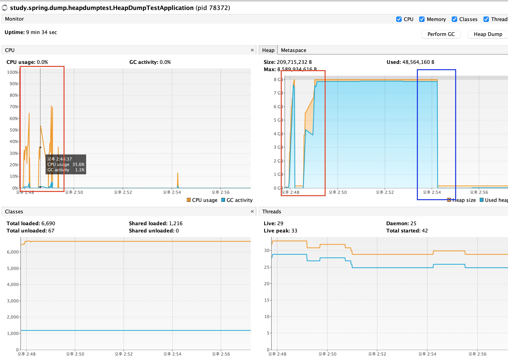
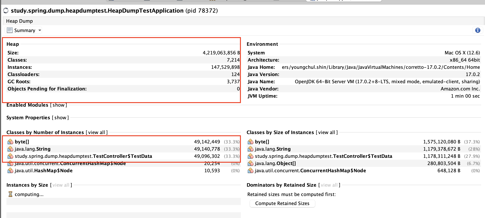

# 저장소 설명
힙 덤프 테스트

# 테스트 내용
대량의 인스턴스를 생성하는 과정에서 힙 메모리의 사용량 변화와, 힙덤프를 통한 내용 확인을 진행해본다

힙메모리 사용량 변화
- [VisualVM](https://visualvm.github.io/) 사용

# 테스트 결과
`/heap-memory-test`를 호출해서 대량의 TestData 인스턴스를 생성한다. 

테스트가 시작되면 CPU가 힙메모리가 올라가는 것이 확인된다.

- 파란색은 GC 수행 이후에 메모리 변경이다

힙덤프를 수행하면, 테스트 인스턴스의 용량이 올라간것을 확인할 수 있다.

