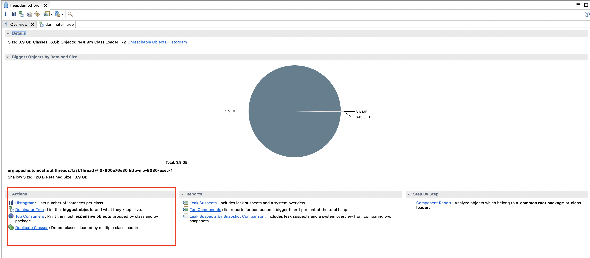
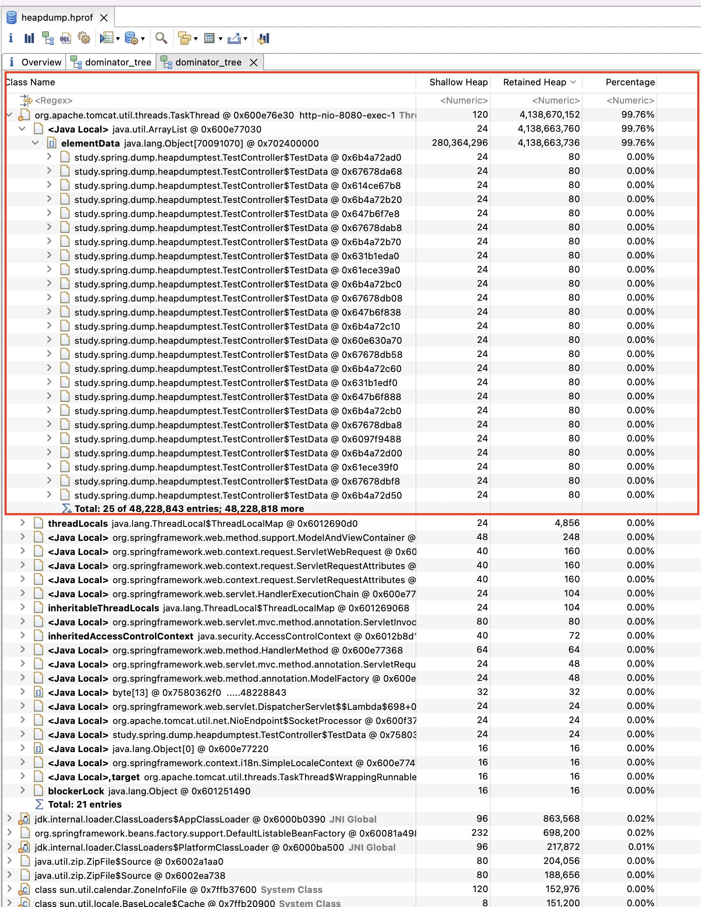

# 저장소 설명
힙 덤프 테스트를 해봅니다. 

# 테스트 내용
대량의 인스턴스를 생성하는 과정에서 힙 메모리의 사용량 변화와, 힙덤프를 통한 내용 확인을 진행해본다.

참고 사이트: https://jupiny.com/2019/07/15/java-heap-dump-analysis/

# 테스트 #1 - 힙 메모리 변화량 모니터링
힙메모리 사용량 변화 도구: [VisualVM](https://visualvm.github.io/) 사용
- VisualVM을 이용하면, 힙메모리 외에 스레드, CPU, GC 등의 상태를 모니터링 할 수 있다

테스트 방법
- API `/heap-memory-test`를 호출해서 대량의 TestData 인스턴스를 생성한다. 

테스트 내역 확인
- 테스트가 시작되면 CPU가 힙메모리가 올라가는 것이 확인된다.
   
   - 파란색은 GC 수행 이후에 메모리 변경이다
- 힙덤프를 수행하면, 테스트 인스턴스의 용량이 올라간것을 확인할 수 있다.
   - 

# 테스트 #2 - 힘 덤프 콘솔에서 진행 및 모니터링
콘솔에서 힙 덤프 진행 방법
1. `jps` 명령어를 이용해서 애플리케이션의 프로세스 ID 확인
2. `jmap` 을 이용해서 덤프 시작
   ```bash
   // 옵션 확인
   jmap --help
   
   // 덤프 커맨드 예시
   jmap -dump:format=b,file={{filename}}.hprof {{process id}}
   ```
3. `memory analyzer tool`을 이용해서 힘덤프 내용 확인
   1. 프로그램 사이트: [Link](https://www.eclipse.org/mat/)
   2. 다운로드 및 프로그램 실행
   3. `Open a Heap Dump` 메뉴 실행
      - `jmap`을 이용해서 생성한 덤프 파일을 불러온다
      - 덤프 용량이 클 경우 상당히 시간이 걸린다
      - OOM나 파일을 읽어오는 중 에러가 발생하면, 최대 메모리양을 올려준다
         ```bash
         // 파일을 열어서
         vi /Applications/mat.app/Contents/Eclipse/MemoryAnalyzer.ini
        
         // -Xmx 값의 메모리 값을 올려준다
         ```
   4. 기본적으로 로딩이 완료되면 summary 정보를 볼 수 있다
   5. `actions`에서 `Dominator Tree` 메뉴를 들어간다
      
   6. 들어가면 트리에서 메모리를 많이 사용하는 객체를 확인할 수 있다
      